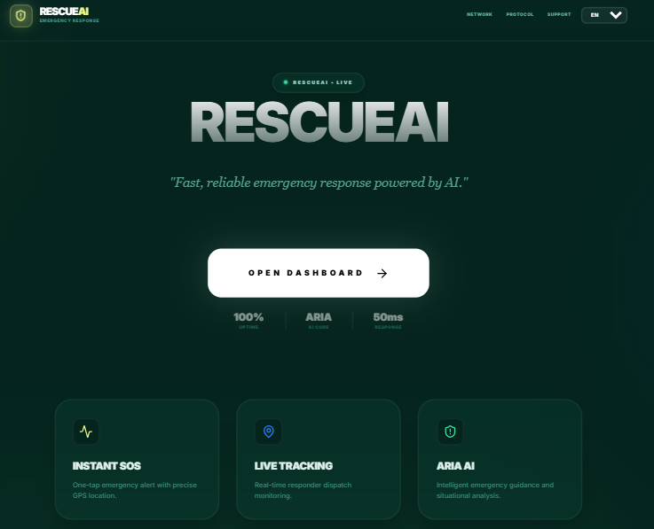
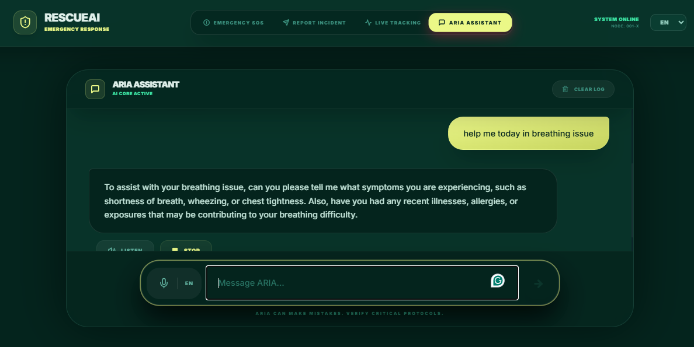
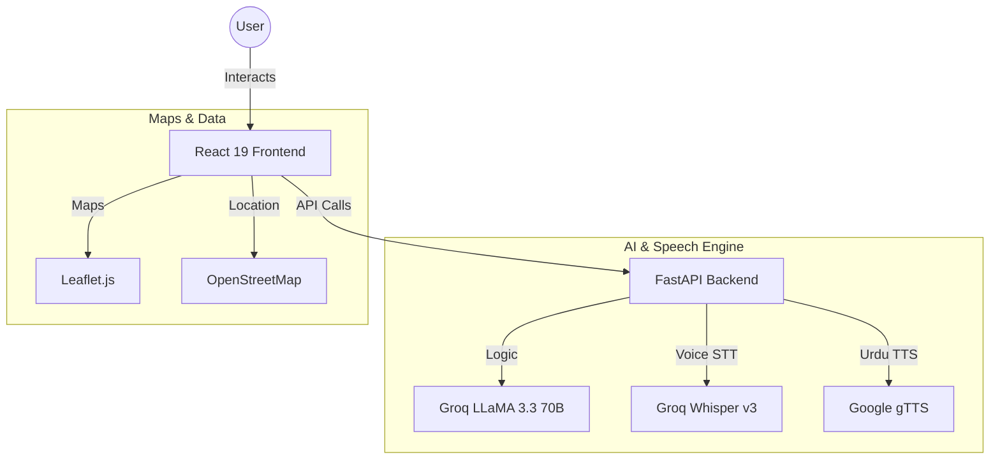
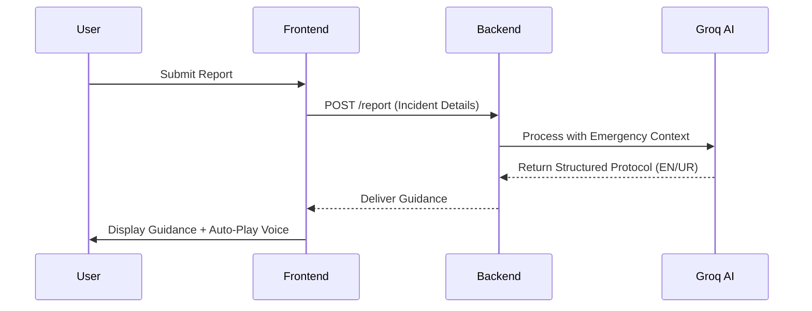

<div align="center">

# 🚨 RescueAI — ریسکیو اے آئی

**AI-powered emergency response platform — built for Pakistan**

[](https://fastapi.tiangolo.com)
[](https://react.dev)
[](https://vitejs.dev)
[](https://www.typescriptlang.org)
[](https://groq.com)
[](https://tailwindcss.com)

**[🌐 Live Demo](https://rescue-ai-two.vercel.app)** · **[📡 API Docs](#)**

</div>

## What Is RescueAI?

**Live Application:** [https://rescue-ai-two.vercel.app](https://rescue-ai-two.vercel.app)

RescueAI is a bilingual emergency response platform that lets anyone in Pakistan trigger an SOS alert, report an incident, track live responder dispatch, and get real-time AI guidance — all in English or Urdu.

The core idea: in a real emergency, you don't have time to navigate a government portal or wait on hold. One tap sends your GPS location, assigns a responder unit, and puts an AI assistant in your hands that can walk you through CPR, bleeding control, or any crisis: by voice if needed.

Built for Pakistan. Works in Urdu. Speaks back to you.



## Features

*   **Emergency SOS**: one-tap alert with GPS coordinates, auto-assigned responder unit, and live ETA
*   **Incident Reporting**: structured report submission with AI-generated response protocol per incident type
*   **Live Tracking**: real-time dispatch monitoring by Alert ID or Report ID
*   **ARIA Assistant**: conversational AI emergency guide for CPR, choking, bleeding, burns, and more
*   **Voice Input**: browser speech recognition for hands-free operation in English and Urdu
*   **Text-to-Speech**: ARIA responses read aloud (English via Web Speech API, Urdu via gTTS)
*   **Bilingual UI**: full English and Urdu support with RTL layout switching



## Architecture

RescueAI uses a modern, decoupled architecture to ensure 100% uptime and zero-latency during emergencies:



## AI Response Pipeline

When you submit an emergency report, the system processes it through a specialized AI pipeline to give you immediate, life-saving advice:



## Tech Stack

| Layer | Technology | Why |
|---|---|---|
| **Intelligence** | Groq LLaMA 3.3 70B | Fast inference, strong multilingual support |
| **Voice Control** | Groq Whisper v3 | Best Urdu transcription accuracy |
| **Speech (Urdu)** | Google gTTS | Correct Urdu script rendering |
| **Backend** | FastAPI | High-performance, async Python server |
| **Frontend** | React 19 + Vite | Modern, snappy user interface |
| **Design** | Tailwind CSS v4 | Clean UI with RTL (Urdu) support |

## Project Structure

```
RescueAI/
├── backend/            # FastAPI app & AI logic
├── frontend/           # React 19 & Tailwind v4
├── screenshots/        # Project images (User Uploaded)
├── .gitignore          # Security & cleanup rules
└── README.md
```

## Local Setup

### Backend
1. Go to `backend/`
2. `pip install -r requirements.txt`
3. Add your `GROQ_API_KEY` to `.env`
4. Run: `python main.py`

### Frontend
1. Go to `frontend/`
2. `npm install`
3. Run: `npm run dev`

## License

MIT — see [LICENSE](LICENSE) for details.

<div align="center">
<sub>Built for Pakistan · AI Emergency Response · Bilingual · Voice-first</sub>
</div>
